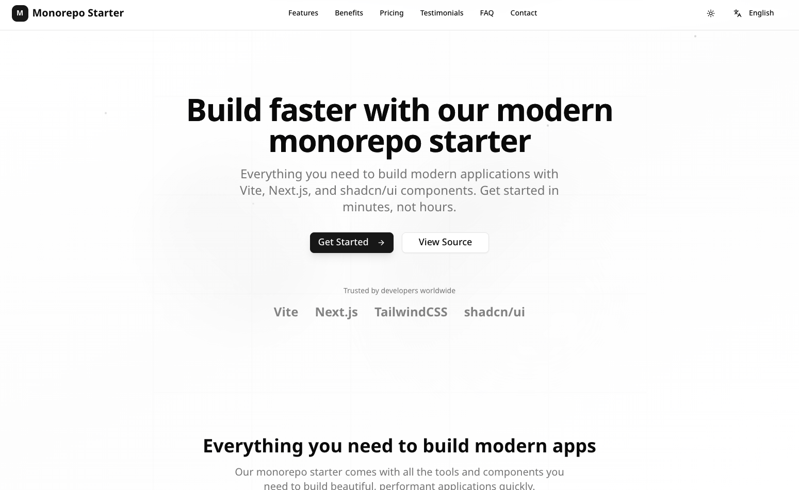

# My Next.js App



A modern, multilingual landing page built with Next.js 15, featuring comprehensive internationalization, animated sections, and beautiful UI components.

[](https://nextjs.org/)
[](https://reactjs.org/)
[](https://www.typescriptlang.org/)
[](https://tailwindcss.com/)

## ✨ Features

- 🚀 **Next.js 15** - Latest App Router with Server Components
- 🌍 **Internationalization** - Full i18n support with next-intl (English/Thai)
- 🎨 **Modern UI** - Built with shadcn/ui components and Tailwind CSS 4
- ✨ **Animations** - Smooth animations with Framer Motion
- 🌙 **Theme Support** - Light/dark mode switching
- 📱 **Responsive Design** - Mobile-first responsive layout
- 🎯 **SEO Optimized** - Meta tags, Open Graph, and Twitter cards
- 🔧 **Developer Experience** - TypeScript, ESLint, and hot reload
- 🚀 **Performance** - Optimized builds with Turbopack

## 📁 Project Structure

```
src/
├── app/                   # Next.js App Router
│   ├── [locale]/         # Internationalized routes
│   │   ├── (auth)/       # Auth route group
│   │   │   └── login/    # Login page
│   │   ├── layout.tsx    # Locale-specific layout with fonts
│   │   ├── page.tsx      # Home page with all sections
│   │   └── not-found.tsx # 404 error page
│   ├── global-error.tsx  # Global error boundary
│   ├── layout.tsx        # Root layout
│   ├── robots.ts         # Robots.txt generation
│   ├── sitemap.ts        # Sitemap generation
│   └── manifest.ts       # PWA manifest generation
├── components/
│   ├── auth/             # Authentication components
│   │   └── login-form.tsx # Login form component
│   ├── layout/           # Layout components
│   │   ├── navbar.tsx    # Navigation header
│   │   └── footer.tsx    # Footer with links
│   ├── sections/         # Landing page sections
│   │   ├── hero-section.tsx         # Hero section with CTA
│   │   ├── features-section.tsx     # Features showcase  
│   │   ├── benefits-section.tsx     # Benefits with folder structure
│   │   ├── pricing-section.tsx      # Pricing plans
│   │   ├── testimonials-section.tsx # Customer testimonials with ratings
│   │   ├── faq-section.tsx          # FAQ with accordion
│   │   ├── contact-section.tsx      # Contact form and info cards
│   │   └── cta-section.tsx          # Call-to-action section
│   ├── ui/              # UI components
│   │   └── next-language-switcher.tsx # Language selector dropdown
│   ├── providers.tsx    # Theme and context providers
│   └── index.ts         # Component exports
├── lib/
│   ├── i18n/            # Internationalization
│   │   ├── locales/     # Translation files
│   │   │   ├── en.json  # English translations
│   │   │   └── th.json  # Thai translations
│   │   └── index.ts     # i18n exports
│   ├── config.ts        # App configuration
│   ├── i18n.ts          # next-intl configuration
│   ├── routing.ts       # Internationalized routing
│   └── utils.ts         # Utility functions
├── styles/
│   └── globals.css      # Global styles and CSS variables
├── types/
│   └── index.ts         # TypeScript type definitions
├── __tests__/           # Test files
│   ├── i18n-final.test.ts  # Comprehensive i18n tests
│   ├── i18n-simple.test.ts # Basic i18n tests
│   ├── i18n.test.tsx       # Component i18n tests
│   └── setup.ts            # Test setup configuration
├── middleware.ts        # Next.js middleware for i18n routing
└── vitest.config.ts     # Vitest configuration
```

## 🚀 Getting Started

### Prerequisites

- Node.js >= 20
- pnpm >= 8.0.0

### Development

1. **Start the development server**
   ```bash
   # From monorepo root
   pnpm dev --filter my-next-app
   
   # Or from this directory
   pnpm dev
   ```

2. **Open your browser**
   - English: [http://localhost:3000](http://localhost:3000) or [http://localhost:3000/en](http://localhost:3000/en)
   - Thai: [http://localhost:3000/th](http://localhost:3000/th)

### Available Scripts

| Command | Description |
|---------|-------------|
| `pnpm dev` | Start development server with Turbopack |
| `pnpm build` | Build for production |
| `pnpm start` | Start production server |
| `pnpm test` | Run unit tests with Vitest |
| `pnpm test:watch` | Run tests in watch mode |
| `pnpm test:ui` | Run tests with Vitest UI |
| `pnpm lint` | Run ESLint |
| `pnpm lint:fix` | Fix ESLint issues |
| `pnpm typecheck` | Run TypeScript check |
| `pnpm clean` | Clean build artifacts |
| `pnpm analyze` | Analyze bundle size |

## 🌍 Internationalization

This application supports multiple languages with next-intl and automatic routing:

### Supported Languages

- **English** (`en`) - Default language
- **Thai** (`th`) - Complete translations

### URL Structure

- `/` → Redirects to `/en` (default locale)
- `/en` → English version
- `/th` → Thai version

### Language Switching

Use the language switcher in the navigation bar to change between English and Thai. The URL automatically updates and all content is dynamically translated.

### Adding Translations

1. Add translation keys to `src/lib/i18n/locales/en.json` and `th.json`
2. Shared translations are in `packages/shared-i18n/src/locales/`
3. Use the `useTranslations` hook in components:

```tsx
import { useTranslations } from 'next-intl'

export default function Component() {
  const t = useTranslations('components.navbar')
  return <h1>{t('home')}</h1>
}
```

### Translation Structure

```json
{
  "components": {
    "navbar": {
      "home": "Home",
      "features": "Features",
      "pricing": "Pricing"
    },
    "hero": {
      "title": "Build faster with our modern monorepo starter",
      "subtitle": "Everything you need to build modern applications..."
    }
  },
  "metadata": {
    "title": "Monorepo Starter - Build faster with modern tools",
    "description": "A modern monorepo starter with Vite, Next.js, Tailwind CSS v4, and shadcn/ui."
  }
}
```

## 🎨 UI Components & Sections

### Landing Page Sections

The application features a comprehensive landing page with these sections:

#### Hero Section
- **Eye-catching headline** with animated text
- **Call-to-action buttons** with hover effects
- **Responsive background** with gradient animations

#### Features Section
- **Six key features** with icons and descriptions
- **Animated cards** that appear on scroll
- **Grid layout** that adapts to screen size

#### Benefits Section
- **Value propositions** with checkmark icons from Lucide React
- **Two-column layout** with benefit list and visual folder structure
- **Monorepo visualization** showing apps/ and packages/ structure
- **Gradient backgrounds** with modern card design

#### Pricing Section
- **Three-tier pricing** (Starter, Professional, Enterprise)
- **Feature comparison** with checkmarks and crosses
- **Popular plan highlighting** with badges
- **CTA buttons** with consistent styling

#### Testimonials Section ⭐
- **5-star ratings** with filled/empty star display
- **Customer avatars** from Unsplash with fallback initials
- **Testimonial cards** with name, role, company, and content
- **3-column responsive grid** (1→2→3 columns)
- **Call-to-action** linking to pricing section

#### FAQ Section ❓
- **Accordion interface** with shadcn/ui components
- **Expandable/collapsible** questions with smooth animations
- **Dynamic FAQ items** loaded from translation files
- **Contact support link** for additional assistance
- **Clean, accessible design** with proper ARIA labels

#### Contact Section 📞
- **Two-column responsive layout**:
  - **Contact information cards** with icons (MapPin, Phone, Mail, Clock)
  - **Complete contact form** with validation
- **Form fields**: First/Last name, Email, Subject dropdown, Message textarea
- **Subject options** dynamically loaded from translations
- **Professional card design** with proper spacing

### Component Architecture

```tsx
// Example animated section usage
import { AnimatedSection, AnimatedItem } from "@/components/animated-section"

export function MySection() {
  return (
    <AnimatedSection className="py-24">
      <div className="grid grid-cols-1 md:grid-cols-3 gap-8">
        {features.map((feature, index) => (
          <AnimatedItem key={feature.id} delay={index * 0.1}>
            <FeatureCard {...feature} />
          </AnimatedItem>
        ))}
      </div>
    </AnimatedSection>
  )
}
```

### Theme & Language Switchers

The navigation includes both theme and language switchers:

- **Theme Switcher**: Toggle between light, dark, and system themes
- **Language Switcher**: Switch between English and Thai with flag icons
- **Persistent Settings**: User preferences are saved in localStorage

## 🧪 Testing

The application includes comprehensive testing with Vitest and Testing Library:

### Test Coverage

- **Internationalization Tests**: Comprehensive i18n system validation
- **Translation Files**: Structural consistency between English and Thai
- **Component Tests**: UI component functionality and rendering
- **Configuration Tests**: Routing, middleware, and app configuration

### Running Tests

```bash
# Run all tests once
pnpm test

# Run tests in watch mode
pnpm test:watch

# Run tests with UI interface
pnpm test:ui
```

### Test Files Structure

```
src/__tests__/
├── i18n-final.test.ts    # Comprehensive i18n integration tests
├── i18n-simple.test.ts   # Basic i18n configuration tests
├── i18n.test.tsx         # Component i18n tests (advanced)
└── setup.ts              # Test environment setup
```

### Example Test

```typescript
import { describe, it, expect } from 'vitest'
import { locales, localeNames } from '@workspace/shared-i18n'

describe('Internationalization', () => {
  it('should have correct locales configured', () => {
    expect(locales).toEqual(['en', 'th'])
    expect(localeNames.en).toBe('English')
    expect(localeNames.th).toBe('ไทย')
  })

  it('should load translations correctly', async () => {
    const enTranslations = await import('@/lib/i18n/locales/en.json')
    expect(enTranslations.default.components.hero.title).toContain('Build faster')
  })
})
```

## 🎯 SEO & Metadata

The application includes comprehensive SEO optimization:

### Meta Tags
```tsx
export const metadata: Metadata = {
  title: "Monorepo Starter - Modern Full-Stack Development",
  description: "A comprehensive monorepo starter with Vite, Next.js, Tailwind CSS, and shadcn/ui components.",
  keywords: ["monorepo", "vite", "nextjs", "tailwind", "shadcn/ui", "typescript", "react"],
  authors: [{ name: "Sathittham s" }],
  openGraph: {
    type: "website",
    locale: "en_US",
    url: "https://sathittham.com",
    title: "Monorepo Starter - Modern Full-Stack Development",
    description: "A comprehensive monorepo starter with modern tools and best practices.",
  },
  twitter: {
    card: "summary_large_image",
    title: "Monorepo Starter - Modern Full-Stack Development",
    description: "A comprehensive monorepo starter with modern tools and best practices.",
    creator: "@sathittham",
  },
}
```

### Structured Data
- Open Graph tags for social media sharing
- Twitter Card metadata for rich previews
- Proper locale and language declarations

## ✨ Animations

The application uses Framer Motion for smooth animations:

### Animation Components

- **AnimatedSection**: Container with intersection observer
- **AnimatedItem**: Individual item animations with configurable delays
- **Background Animations**: Floating elements and gradients

### Animation Patterns
```tsx
// Fade in animation
const fadeInUp = {
  initial: { opacity: 0, y: 60 },
  animate: { opacity: 1, y: 0 },
  transition: { duration: 0.6 }
}

// Stagger children
const staggerChildren = {
  animate: {
    transition: {
      staggerChildren: 0.1
    }
  }
}
```

## 🔧 Configuration

### Next.js Configuration

```js
// next.config.mjs
import createNextIntlPlugin from 'next-intl/plugin'

const withNextIntl = createNextIntlPlugin('./lib/i18n.ts')

export default withNextIntl({
  experimental: {
    turbo: {
      unstable_turbopackOptions: {
        conditions: ['tailwindcss']
      }
    }
  }
})
```

### Internationalization Setup

```ts
// lib/i18n.ts
import { getRequestConfig } from 'next-intl/server'
import { enTranslations, thTranslations } from '@workspace/i18n'

export default getRequestConfig(async ({ locale }) => ({
  messages: locale === 'th' ? thTranslations : enTranslations
}))
```

### Middleware

```ts
// src/middleware.ts
import createMiddleware from 'next-intl/middleware'
import { routing } from './lib/routing'
 
export default createMiddleware(routing)
 
export const config = {
  // Match only internationalized pathnames
  matcher: ['/', '/(th|en)/:path*']
}
```

### Routing Configuration

```ts
// src/lib/routing.ts
import { createNavigation } from 'next-intl/navigation'
import { locales, defaultLocale } from '@workspace/shared-i18n'

export const routing = {
  locales,
  defaultLocale,
  localePrefix: 'as-needed' as const
}

export const { Link, redirect, usePathname, useRouter } =
  createNavigation(routing)
```

## 🚀 Building for Production

```bash
# Build the application
pnpm build

# Start production server
pnpm start
```

### Build Optimization

- **Turbopack**: Fast development builds
- **Code Splitting**: Automatic route-based splitting
- **Image Optimization**: Next.js built-in image optimization
- **Bundle Analyzer**: Analyze bundle size with `@next/bundle-analyzer`

### Deployment Options

The app is ready for deployment on:

- **Vercel** (recommended for Next.js)
- **Netlify**
- **Railway**
- **AWS Amplify**
- **Docker containers**

## 🎨 Styling

### Tailwind CSS 4

The application uses the latest Tailwind CSS 4 features:

```css
/* Custom utilities in globals.css */
@tailwind base;
@tailwind components;
@tailwind utilities;

@layer base {
  :root {
    --background: 0 0% 100%;
    --foreground: 240 10% 3.9%;
    /* ... more CSS variables */
  }
}
```

### Font Configuration

Multiple fonts are configured for different languages:

- **Geist**: Modern sans-serif for English
- **Noto Sans Thai**: Optimized for Thai text
- **Sarabun**: Alternative Thai font
- **Geist Mono**: Monospace font

## 📚 Learn More

- [Next.js 15 Documentation](https://nextjs.org/docs)
- [next-intl Documentation](https://next-intl-docs.vercel.app/)
- [Framer Motion Documentation](https://motion.dev/)
- [shadcn/ui Documentation](https://ui.shadcn.com/)
- [Tailwind CSS Documentation](https://tailwindcss.com/docs)

## 🤝 Contributing

This application follows the monorepo's contribution guidelines. See the [main README](../../README.md) for detailed instructions.

---

Part of the [Monorepo Vite + Next.js + Tailwind CSS + shadcn/ui](../../README.md) starter template.