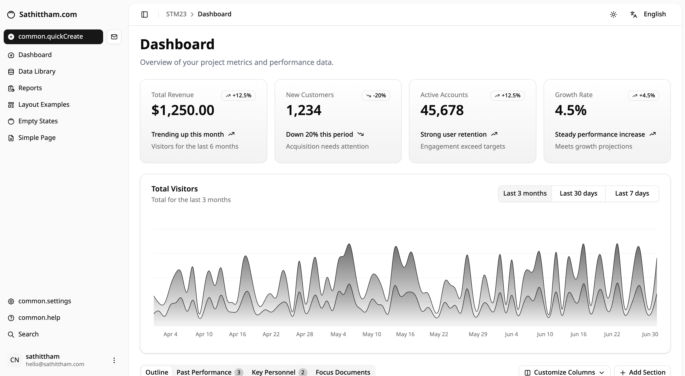

# My Vite App



A modern enterprise dashboard built with Vite, React, and shadcn/ui components, featuring comprehensive internationalization support.

[](https://reactjs.org/)
[](https://vitejs.dev/)
[](https://www.typescriptlang.org/)
[](https://tailwindcss.com/)

## ✨ Features

- 🚀 **Vite + React 19** - Fast development with Hot Module Replacement
- 🎨 **Modern UI** - Built with shadcn/ui components and Tailwind CSS 4
- 🌍 **Internationalization** - Full i18n support with English and Thai languages
- 🔐 **Authentication** - User authentication with protected routes
- 📊 **Interactive Dashboard** - Data tables, charts, and analytics
- 🎯 **Enterprise-Ready** - Comprehensive page layouts and navigation
- 🌙 **Theme Support** - Light/dark mode switching
- 📱 **Responsive** - Mobile-first responsive design
- 🔧 **Developer Experience** - TypeScript, ESLint, and hot reload

## 📁 Project Structure

```
src/
├── app/                    # Application pages
│   ├── dashboard/         # Dashboard with charts and tables
│   ├── data-library/      # Data management pages
│   ├── reports/           # Reporting interface
│   ├── settings/          # User settings
│   ├── search/            # Search functionality
│   ├── help/              # Help and support
│   ├── layout-examples/   # Layout demonstrations
│   ├── simple-page/       # Simple page example
│   ├── empty-example/     # Empty state example
│   ├── login/             # Authentication
│   └── 404/               # Error handling
├── components/            # Reusable components
│   ├── page-layout.tsx   # Main layout component
│   ├── site-header.tsx   # Header with breadcrumbs
│   ├── nav-main.tsx      # Main navigation
│   ├── nav-user.tsx      # User menu
│   ├── data-table.tsx    # Interactive data table
│   └── chart-*.tsx       # Chart components
├── contexts/              # React contexts
│   └── auth-context.tsx  # Authentication context
├── lib/                   # Utilities and configurations
│   ├── i18n.ts           # Internationalization setup
│   └── utils.ts          # Utility functions
└── main.tsx              # Application entry point
```

## 🚀 Getting Started

### Prerequisites

- Node.js >= 20
- pnpm >= 8.0.0

### Development

1. **Start the development server**
   ```bash
   # From monorepo root
   pnpm dev --filter my-vite-app
   
   # Or from this directory
   pnpm dev
   ```

2. **Open your browser**
   Navigate to [http://localhost:5176](http://localhost:5176)

3. **Login**
   Use any credentials to access the dashboard (demo authentication)

### Available Scripts

| Command | Description |
|---------|-------------|
| `pnpm dev` | Start development server |
| `pnpm build` | Build for production |
| `pnpm preview` | Preview production build |
| `pnpm lint` | Run ESLint |

## 🌍 Internationalization

This application supports multiple languages with react-i18next:

### Supported Languages

- **English** (`en`) - Default language
- **Thai** (`th`) - Complete translations

### Language Switching

Use the language switcher in the header to change between English and Thai. All UI components, navigation, forms, and content are fully translated.

### Adding Translations

1. Add translation keys to `packages/i18n/src/locales/en.json` and `th.json`
2. Use the `useTranslation` hook in components:

```tsx
import { useTranslation } from 'react-i18next'

export default function Component() {
  const { t } = useTranslation()
  return <h1>{t('pages.dashboard.title')}</h1>
}
```

## 🎨 UI Components

Built with [shadcn/ui](https://ui.shadcn.com/) components for consistency and accessibility:

### Key Components

- **PageLayout** - Main layout with sidebar and header
- **SiteHeader** - Header with breadcrumbs and actions
- **DataTable** - Interactive table with sorting, filtering, and pagination
- **Charts** - Recharts integration for data visualization
- **Navigation** - Sidebar navigation with user menu
- **Forms** - Comprehensive form components with validation

### Component Usage

```tsx
import { PageLayout } from "@/components/page-layout"
import { Button } from "@workspace/ui/components/button"
import { Card, CardContent, CardHeader, CardTitle } from "@workspace/ui/components/card"

export default function MyPage() {
  const breadcrumbs = [
    { label: "Dashboard", href: "/dashboard" },
    { label: "My Page", current: true }
  ]

  return (
    <PageLayout 
      headerBreadcrumbs={breadcrumbs}
      headerActions={<Button>Action</Button>}
    >
      <Card>
        <CardHeader>
          <CardTitle>Welcome</CardTitle>
        </CardHeader>
        <CardContent>
          <p>Your content here</p>
        </CardContent>
      </Card>
    </PageLayout>
  )
}
```

## 📊 Features Overview

### Dashboard
- Revenue and analytics cards
- Interactive area charts with time range selection
- Data tables with search, sort, and pagination
- Real-time data visualization

### Data Library
- File management interface
- Upload and import functionality
- Data source management

### Reports
- Report generation and management
- Export capabilities
- Historical data access

### User Management
- User authentication and profiles
- Settings and preferences
- Account management

### Responsive Design
- Mobile-first approach
- Sidebar collapses on mobile
- Touch-friendly interactions
- Optimized for all screen sizes

## 🔧 Configuration

### Tailwind CSS

The app uses Tailwind CSS 4 with custom utilities and Vite integration:

```js
// vite.config.ts
import tailwindcss from '@tailwindcss/vite'

export default defineConfig({
  plugins: [
    react(),
    tailwindcss()
  ]
})
```

### ESLint

ESLint is configured with React and TypeScript rules:

```bash
pnpm lint  # Check for issues
pnpm lint --fix  # Auto-fix issues
```

## 🚀 Building for Production

```bash
# Build the application
pnpm build

# Preview the build
pnpm preview
```

The build outputs to `dist/` directory with optimized assets ready for deployment.

## 📚 Learn More

- [Vite Documentation](https://vitejs.dev/guide/)
- [React Documentation](https://reactjs.org/docs/)
- [shadcn/ui Documentation](https://ui.shadcn.com/)
- [Tailwind CSS Documentation](https://tailwindcss.com/docs)
- [react-i18next Documentation](https://react.i18next.com/)

---

Part of the [Monorepo Vite + Next.js + Tailwind CSS + shadcn/ui](../../README.md) starter template.